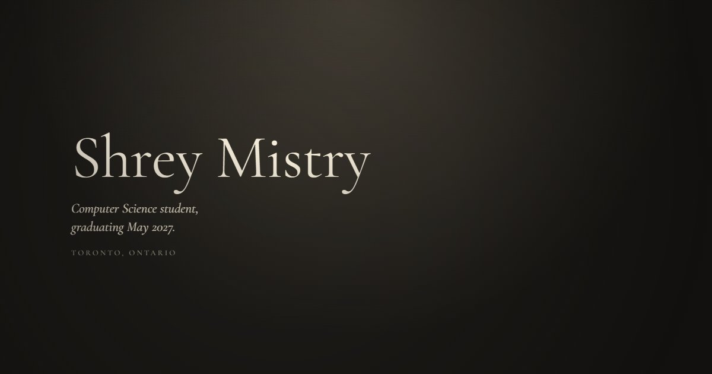

# Shrey Mistry

My portfolio, built as a small gallery you walk through: **[shreywy.github.io](https://shreywy.github.io)**



I'm a Computer Science student at Toronto Metropolitan University, graduating May 2027. The site hangs my internships at Geotab, AMD, and Bombardier, the projects I'm proudest of, my education, and my resume as pieces in a dark exhibition hall. Scroll or drag to walk through it, and click anything to look closer.

## What's in the hall

- **Entrance.** Just my name, and a short walk into the room.
- **Internships.** Each role is a paper object on the wall: a framed certificate, a page of graph paper, a report folder. A timeline above runs newest to oldest. Click a role for what I did, the team, and the tools.
- **Projects.** Screenshots hang in gilt, walnut, ebony, and silver frames on one size system. Hover a frame and the cursor becomes a loupe that magnifies it. Click one and the frame slides away on a rail to show the story, a scrolling preview of the project's own site or its repo, and links.
- **Education.** A diploma, with honors and coursework behind it.
- **Resume.** A stack of pages that opens the current PDF.
- **Guestbook.** Leave a note and it lands in my inbox.

The progress bar at the bottom shows where each room starts when you hover it. Click a dot or drag the bar to skip ahead. On phones the hall becomes a vertical walk.

## How it's built

Plain HTML, CSS, and JavaScript. No framework, no build step, no dependencies. Everything is served as static files from GitHub Pages.

```
index.html          the hall: layout, motion, and the closer-look pages
gallery-data.js     every project, role, and degree on the walls
assets/             screenshots, site and repo previews, company logos
resumes/            the resume PDF
tools/guestbook/    the Google Apps Script behind the guestbook form
```

All the motion is hand-written: springs for the frames and loupe, the Web Animations API for the frame-on-a-rail reveal, and `prefers-reduced-motion` turns it all off.

## Adding a project

Everything on the walls comes from `gallery-data.js`, so the wall, the caption, and the closer look never drift apart.

1. Put screenshots in `assets/`.
2. Copy a block in `window.PROJECTS` and fill it in. The comments at the top of the file explain each field.
3. If the project has a live site, add `page: { url, poster, full }`, where `full` is a full-page screenshot. The closer look scrolls through it and can switch to the live site. Otherwise add a cropped GitHub capture as `gh`.
4. Set `hidden: true` to take a piece down without deleting it.

Roles and education work the same way in `window.EXPERIENCE` and `window.EDUCATION`.

## Updating the resume

Drop the new PDF in `resumes/` and update the file name and date in `window.RESUME` at the bottom of `gallery-data.js`.

## The guestbook

The form posts to a Google Apps Script web app that writes each note to a Google Sheet and emails it to me, with a hidden spam field, a one-note-per-minute limit for each email address, and a daily cap. The source is in `tools/guestbook/`. To change it:

```bash
cd tools/guestbook
clasp push
clasp deploy --deploymentId <the existing deployment id>
```

Redeploying to the same deployment keeps the URL in `index.html` working.

## Running it locally

Any static server works:

```bash
python -m http.server 8000
```

Then open `http://localhost:8000`.

## Earlier versions

Previous versions of the site live on their own branches: `terminal-portfolio`, `old-portfolio`, and `archive-portfolio-1` to `-4`. The design drafts that led to this one are on `design-drafts`.
